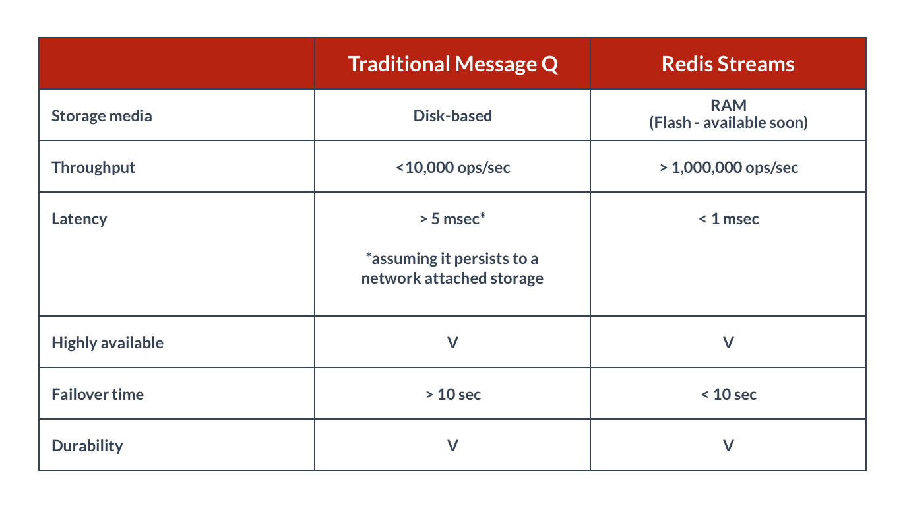
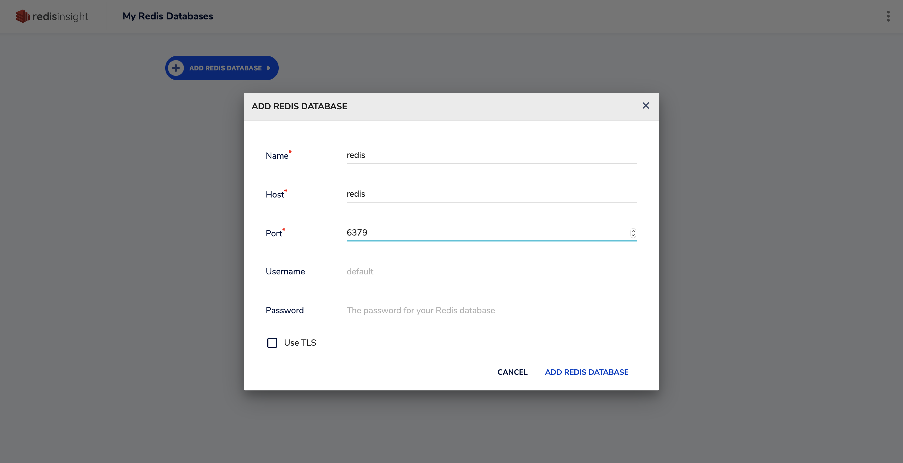
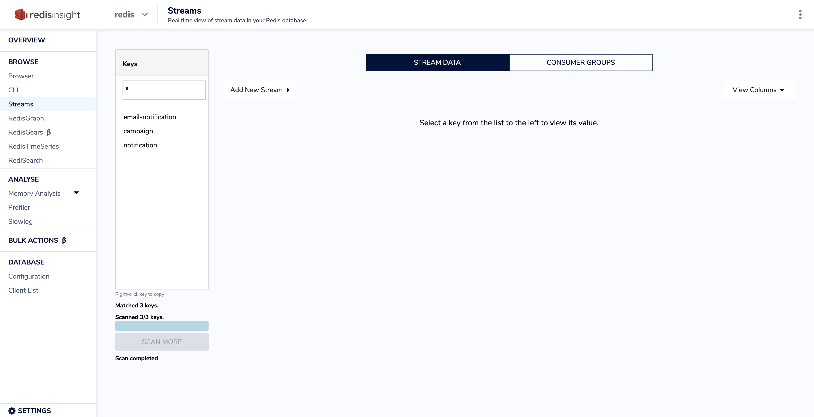
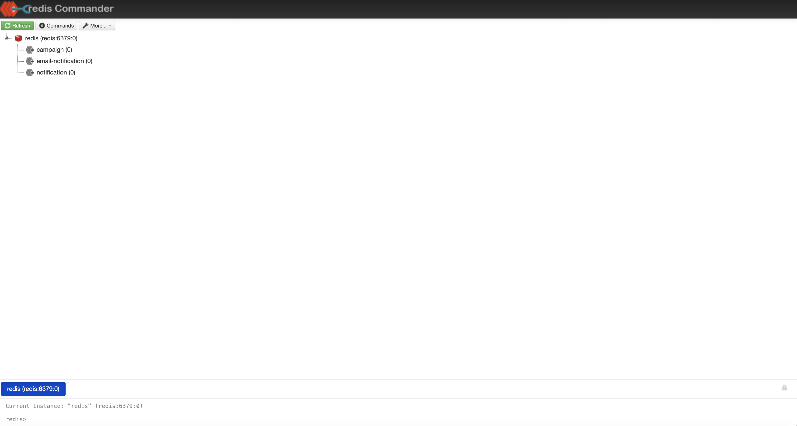
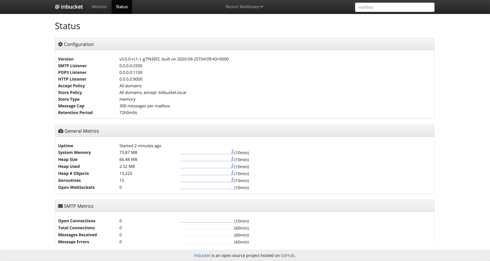
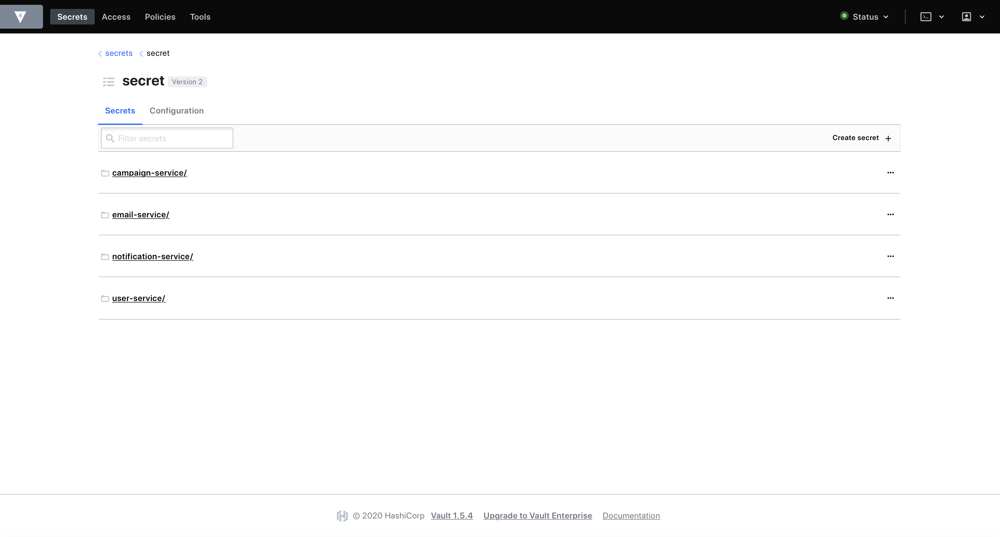
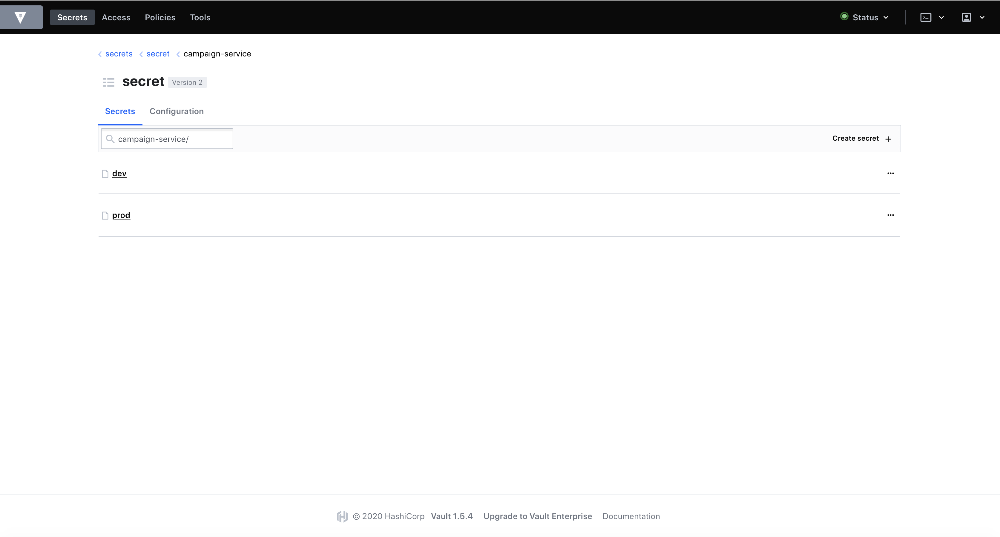

# Communications Service POC

Sample Communications Service, designed and implemented in microservices architecture.

4 microservices (campaign, email, user, notification) use an event store built with Redis Streams for inter-service communication.

Streams is a new data type introduced with Redis 5.0 and basically, it is an append-only data structure. (Although it is append-only, you can remove messages from the log)

Redis Streams and Redis Pub/Sub looks similar in some ways. Although the existing Pub/Sub can be used as a message queue service in simple scenarios, Redis Streams is more comprehensive. 

It provides message persistence and master/slave data replication functions; it also has the new RadixTree data structure to support more efficient memory use and message reading.

The main differences between Redis Pub/Sub and Redis Streams are:

### Sync/Async communication

Pub/Sub is synchronous communication. All parties need to be active at the same time to be able to communicate.

Redis Streams allows for both synchronous and asynchronous communication. It is like Pub/Sub, but with the ability to resume on disconnection without losing messages.

### Delivery Semantics

Pub/Sub is at-most-once, i.e. "fire and forget".

Redis Streams allows for both at-most-once or at-least-once (explicit acknowledgement sent by the receiver)

## Data storage

Pub/Sub is a Publisher/Subscriber platform, it's not data storage. Published messages evaporate, regardless if there was any subscriber.

In Redis Streams, messages or entries are stored in memory and stay there until commanded to be deleted.

### Fan-out
Pub/Sub is fan-out only. All active clients get all messages.

Redis Streams allows fan-out, but also to provide a different subset of messages from the same stream to many clients. This allows scaling message processing, by routing different messages to different workers, in a way that it is not possible that the same message is delivered to multiple consumers. This is achieved with consumer groups.


Redis Streams has the concept of consumer groups, like the similar concept in Apache Kafka. Consumer groups were initially introduced by the popular messaging system Apache Kafka. Redis reimplements a similar idea in completely different terms, but the goal is the same: to allow a group of clients to cooperate consuming a different portion of the same stream of messages.

We can use Redis Streams as a message queue but it also has some significant differences from traditional message queues.





### To build and run this project, execute the command below

```sh
$ ./start.sh build-docker
```

This command will build all the images and run the containers.

### To stop, execute the command below

```sh
$ ./stop.sh stop-docker
```

For the demo purposes, user-service will populate the users table with 100.000 fake user records at the startup.

When a new campaign is created, all the users get notified.

campaign-service serves on port 8080 and you can create a new campaign by sending a GET request to the following service endpoint.

http://localhost:8080/api/v1/campaign/create

After campaign creation, you can track all notification streams from RedisInsight and RedisCommander dashboards.

To access RedisInsight, go to url:
http://localhost:8001/

In order to use __RedisInsight__, you need to add your redis database first.



After adding the redis database, you can view redis instance information in the details page.



You can also view your streams information in Redis Commander by visiting http://localhost:8081



For simulating email sending, Inbucket email testing application is used. You can access Inbucket dashboard and track all the outgoing emails from the url below:

http://localhost:9000



In order to store the secrets (db urls, passwords etc..) safely, Hashicorp Vault is used and for the demonstration, it is populated with some predefined secrets at the startup.

You can access Vault Dashboard from the url below:

http://localhost:8200
Root Token Value is "0000"



By using Vault, we can set different properties and secrets for "dev" and "prod" environments.




License
----
MIT

